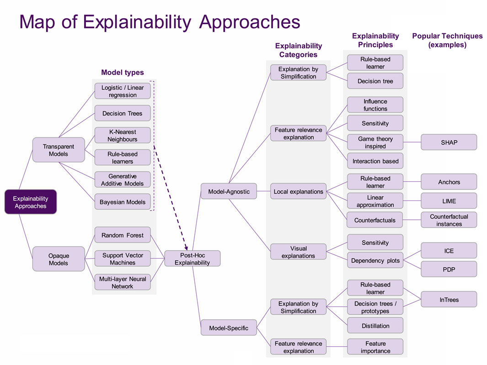
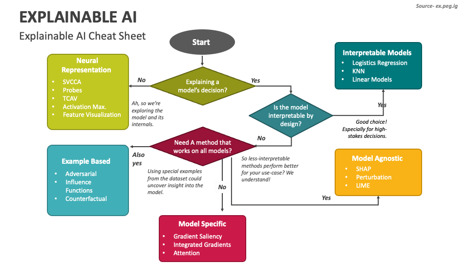

# WEITA 2025 Explainable AI workshop

## Choosing the explainability method
To choose which explainability tool and methods to choose you can follow the cheat sheet below.

For extra details, you can refer to this taxonomy.

## Model Agnostic

Methods:
- **LIME**: It's an instance based technique that replaces a model by another one less complex (KNN, logistic regression, linear regressing, etc) to explain in the vicinity of a selected instance. It applies perturbations to an instance x that we want to study, predict to label using the model we want to expalin and minimizes the error between the main model and the local model.

- **SHAP**
- **Anchor**

Libraries:
- [Alibi](https://docs.seldon.io/projects/alibi/en/latest/) (for Anchor)
- [Dalex](https://dalex.drwhy.ai/) (for SHAP)
- [AIX360](https://aix360.readthedocs.io/en/latest/) (for LIME)

## Model Specific

These are methods that are specific to certain types of models such as Neural Networks.

Methods:
- **LRP**
- **Saliency map**: It uses the gradients which is used to update the weights. It points ot he steepest ascent direction. We use it to explain through an instance and not the weights.
- **Integrated Gradient**: It also uses the gradients but it needs a reference data.
The steps are the following:
1. Compare x with the baseline (no information)
2. interpolate between the point of this baseline and input x
3. take the gradient with respect to each interpolated input
4. compute the average of these vectors

[Demo](https://lrpserver.hhi.fraunhofer.de/) for testing different methods in LRP AI explainability.

Details about the event: [https://www.esb.tn/evenement-s/weita-2025/.](https://www.esb.tn/evenement-s/weita-2025/.)

## Sources:
[https://www.frontiersin.org/journals/big-data/articles/10.3389/fdata.2021.688969/full](https://www.frontiersin.org/journals/big-data/articles/10.3389/fdata.2021.688969/full)

[https://www.collidu.com/presentation-explainable-ai](https://www.collidu.com/presentation-explainable-ai)

[https://arxiv.org/pdf/1602.04938](https://arxiv.org/pdf/1602.04938)

[https://arxiv.org/pdf/1705.07874](https://arxiv.org/pdf/1705.07874)

[https://homes.cs.washington.edu/~marcotcr/aaai18.pdf](https://homes.cs.washington.edu/~marcotcr/aaai18.pdf)

[https://arxiv.org/pdf/1604.00825](https://arxiv.org/pdf/1604.00825)

[https://arxiv.org/pdf/1703.01365](https://arxiv.org/pdf/1703.01365)